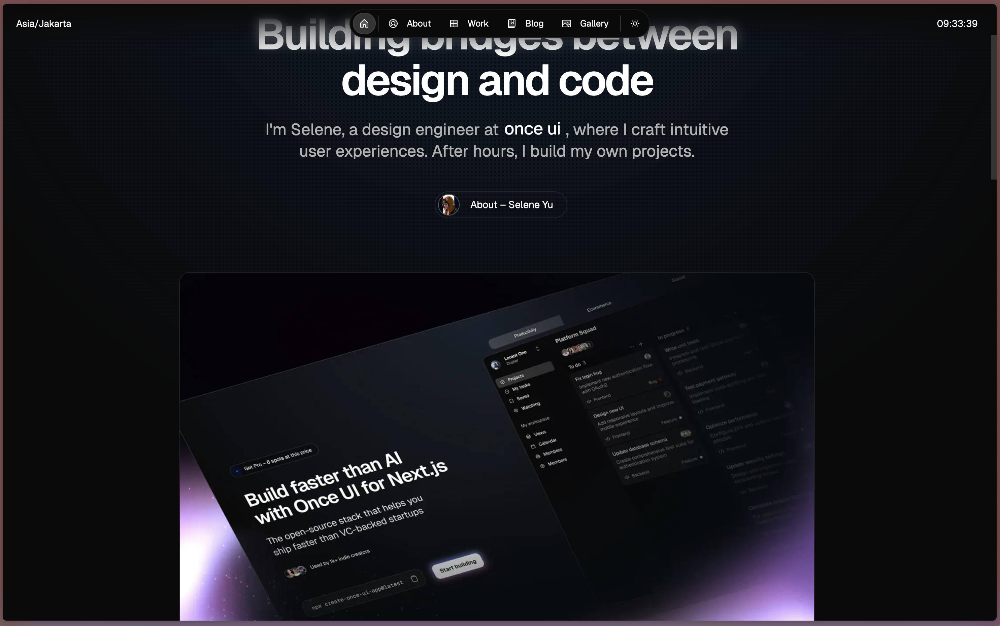

# Project: gaayak.org landing page

## Goal:
- A single, scrollable landing page that clearly states our motivation and mission for improving Indian singing education. 
- This is a manifesto and email-collection page, not a product showcase.

## Stack & style:
- Use a modern, responsive, accessible design system.
- Keep the code clean and semantic. Avoid over-engineering; no need for Tailwind if not required. A lightweight component library or plain CSS-in-JS is fine. Note that I have some experience with Next.js with MUI library, but you're free to choose what works best.
- Prioritize fast load, SEO-friendly structure, and accessibility.

## Visual style:
- Modern, sophisticated, look.
- Background contains an animation that toggles between different settings of singing like playback singing in studio, performing on a stage, recording at home on a computer (with a sound production software like audacity open on the computer), busking on a touristy street, etc.
- Note that these are not actual images with people and items but abstract shapes created by a light trails created by musical notes for example

### Some Design Inspiration For The Colours

## Page structure:

### Hero (above the fold):
   
#### Headline Options
1. Clear, Balanced, Accessible Indian Singing Education
2. Making Indian Singing Education Clear, Balanced, and Accessible
3. Practical, Transparent Training for Indian Singing

#### Sub-headline Options

1. Because learning to sing shouldn’t mean straining your voice, getting vague feedback, or memorizing without progress.
2. Because learning to sing shouldn’t mean chronic vocal strain, unclear direction, or rote repetition without purpose.
3. Because learning to sing shouldn’t mean guessing whether you’re improving, being told exercises without context, or trading health for technique.
4. Because learning to sing shouldn’t mean lessons that reward memorization over usable skill, or leave you without clear feedback.
5. Because learning to sing shouldn’t mean accepting painful technique, confusing advice, or one‑size‑fits‑all teaching.
6. Because learning to sing shouldn’t mean practicing blindly: strain, vague feedback, and traditions that don’t translate.
   
Primary CTA: "Be the first to know when we launch"
Simple email form (name + email), privacy note: "No spam. Occasional progress updates."

1) The Problem:
   In the Indian education system, one recurring problem has been the lack of focus on the *“why”* behind concepts.  
   - We were given log tables to perform multiplications, but rarely told why adding logs replaces multiplication.  
   - We were told the area of a circle is πr², but not how it’s derived, or where π actually comes from.  

   Indian singing education often feels the same. For instance, we’re taught to memorize *Sa Re Ga Ma Pa Dha Ni Sa* without being told:  
   - What it really means  
   - Why it matters in Indian music  
   - Whether mastering it is essential, or if one can still be a good singer without it  

2) The Vision:
   Singing is not about one skill alone. It’s a blend of many elements:  
   - Breathing  
   - Pitch accuracy  
   - Vocal tone  
   - Vocal range and fluidity  
   - Voice modulation  
   - Your unique style  

   Excelling in just one while neglecting the others rarely works. But being reasonably good at most of them can already make you a strong singer.

3) The Gap Today:
   Most resources for learning Indian singing — especially for mainstream Hindi music — fall short. They often:  
   - Fail to explain what these elements are  
   - Fail to show how to improve in each  
   - Fail to define what “good enough” looks like  
   - Fail to give clear, detailed feedback  

   Even highly skilled classical *gurus* tend to emphasize some elements while neglecting others, which may not suit every learner’s goals. And when high-quality, balanced training *is* available, it’s usually accessible only to a privileged few.

4)  gaayak.org’s Aim:
   Our mission is simple:  
   - Provide a structured, balanced, and practical approach to Indian singing training  
   - Make these resources accessible to everyone, leveling the playing field  

5)  Final CTA:
   Want to follow our journey?  
   Sign up to get updates as we build gaayak.org.  
   [Email signup form]  
   Secondary action: "Share your thoughts" → lightweight feedback form placeholder

Design cues:
- Calm, confident, modern. Matte finish, subtle section dividers (background shifts or thin rules).
- Accessibility: sufficient contrast, alt text, semantic HTML.
- Footer: “Made with care in Toronto” + placeholder contact email.

Extras:
- Basic SEO: title, meta description, open graph tags
- Privacy-friendly email capture: Formspree or Buttondown (placeholder action with clear TODO in code)
